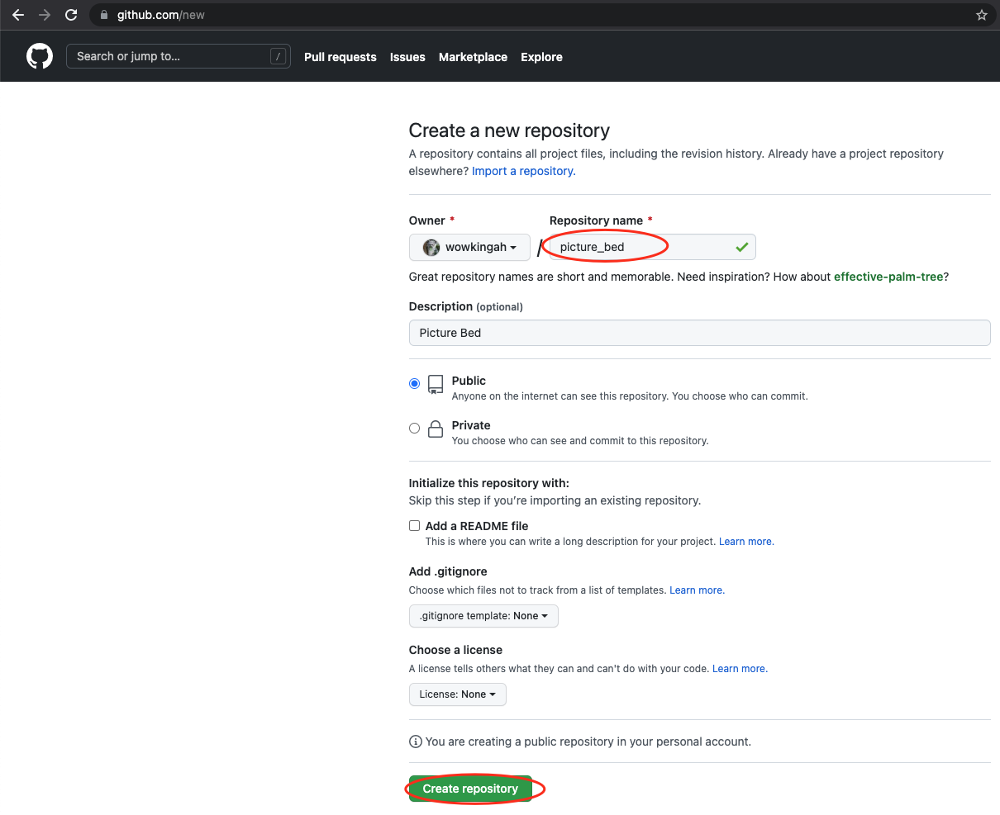
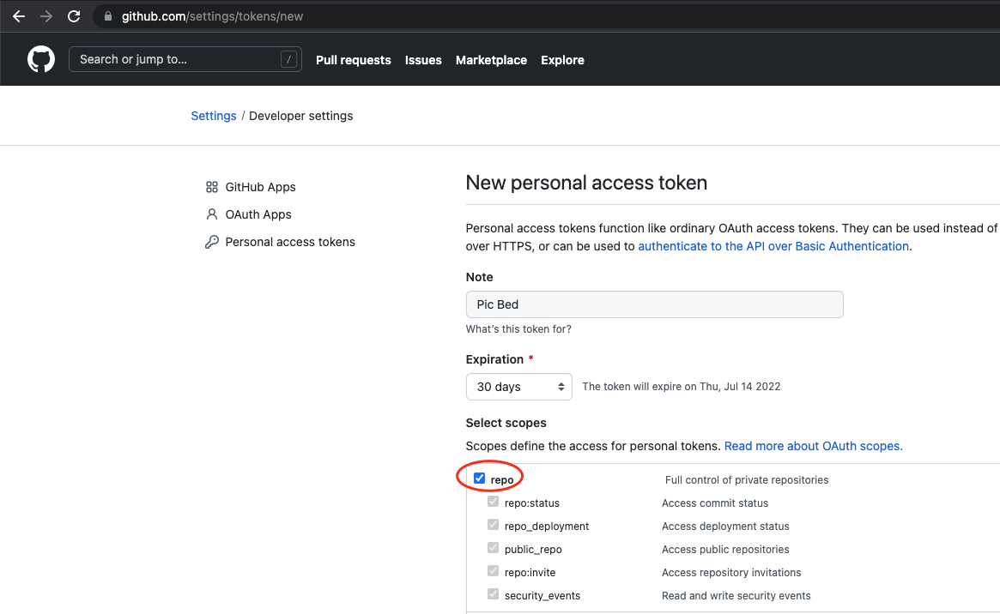
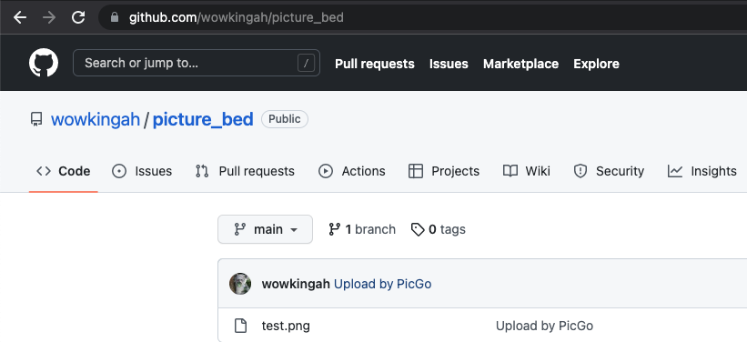
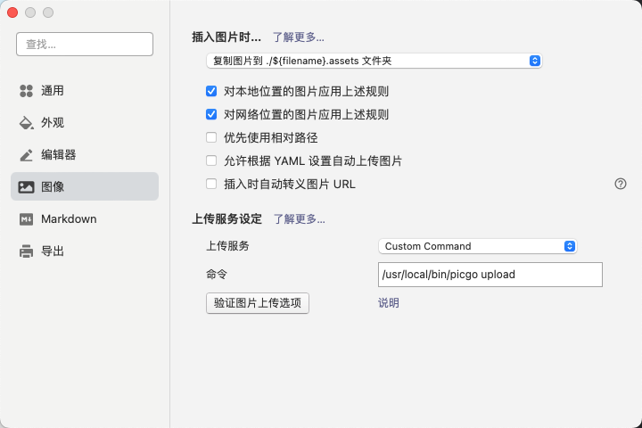
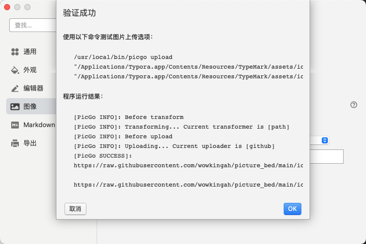
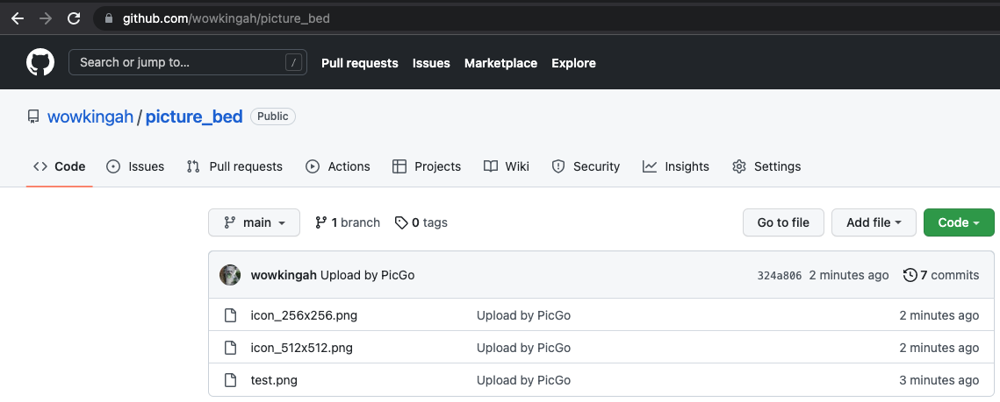
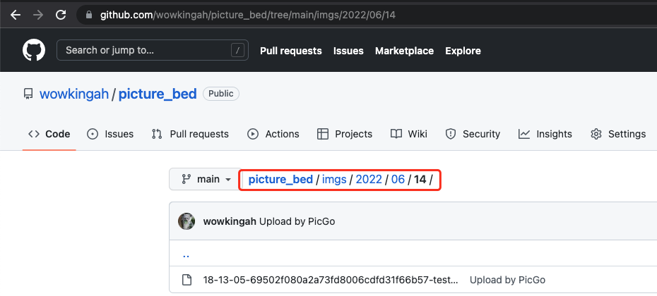

# **Typora 用 Github 实现图床**

# 环境

- Typora for mac v1.3.6：编辑器；
- Picgo-Core：Picgo-Core 是 PicGo 的 CLI 版本，也可使用 Picgo-Core，其功能更多，使用更简单（仅个人不太喜欢安装过多 GUI 工具）；
  - Mac 电脑安装 Picgo-Core 依赖 NPM；
  - GITHUB 地址 `https://picgo.github.io/PicGo-Core-Doc`
- rename-file：Picgo 的重命名插件；
  - GITHUB 地址 `https://github.com/liuwave/picgo-plugin-rename-file`

# 安装

## GITHUB

### 创建 Repository

Github - new repository



### 创建 Token

Github - Settings - Developer settings - Personal access tokens - Generate new token

选择合适的 Expiration，Select scopes 指定 `repo` 后，点击 Generate token 会生成 `Token`，复制该 `Token`（只会出现一次，丢失后重新创建）。



## Picgo-Core

```bash
# node
wowking@WowkingdeMacBook-Pro ~ % brew install node

# 全局安装 picgo
wowking@WowkingdeMacBook-Pro ~ % npm install picgo -g

# 配置 picgo，通过自动生成的方式配置 Uploader，也手动生成，详见文档。
wowking@WowkingdeMacBook-Pro ~ % picgo set uploader
? Choose a(n) uploader github		# 选择 github
? repo: wowkingah/picture_bed		# 仓库名，格式 username/reponame
? branch: main									# github 分支
? token: xxxxxx									# 刚创建的 Token
? path:													# 非必填项，上传到 github 的目录路径
? customUrl:										# 非必填项，可配置使用免费开源的 CDN，如 https://www.jsdelivr.com
[PicGo SUCCESS]: Configure config successfully!

# 选择 Uploader
wowking@WowkingdeMacBook-Pro ~ % picgo use uploader
? Use an uploader github
[PicGo SUCCESS]: Configure config successfully!

# 查看配置文件
wowking@WowkingdeMacBook-Pro ~ % cat ~/.picgo/config.json
{
  "picBed": {
    "uploader": "github",
    "current": "github",
    "github": {
      "repo": "wowkingah/picture_bed",
      "branch": "main",
      "token": "xxxxxx",
      "path": "",
      "customUrl": ""
    },
    "transformer": "path"
  },
  "picgoPlugins": {}
}%
```

# 测试

## 命令测试

```bash
# 图片根据自己实际情况选择
wowking@WowkingdeMacBook-Pro ~ % picgo upload Desktop/test.png
[PicGo INFO]: Before transform
[PicGo INFO]: Transforming... Current transformer is [path]
[PicGo INFO]: Before upload
[PicGo INFO]: Uploading... Current uploader is [github]
[PicGo SUCCESS]:
https://raw.githubusercontent.com/wowkingah/picture_bed/main/test.png
```

### GITHUB 查看

在 GITHUB 指定 Repo 查看上传记录。



## Typora 测试

### Picgo 设置

Typora - 偏好设置 - 图片 - 上传服务设定

上传服务：`Custom Command`

命令：`picgo upload`

 *Tips:*

1. 命令 picgo 可使用绝对路径；

2. 可设置 插入图片时 复制图片到xx，如下图：

   

### Picgo 测试

点击 验证图片上传选项，如下图：



### GITHUB 查看



# 插件

## rename-file

Rename-file 根据指定后缀方式实现文件不重名。

### 安装配置

```bash
# install
wowking@WowkingdeMacBook-Pro ~ % picgo install rename-file

added 1 package, and audited 2 packages in 2s

found 0 vulnerabilities
[PicGo SUCCESS]: 插件安装成功

# config，指定固定前缀为 imgs，其它参数插件自动生成
wowking@WowkingdeMacBook-Pro ~ % sudo vim ~/.picgo/config.json
{
...
  "picgoPlugins": {
    "picgo-plugin-rename-file": true
  },
  // add
  "picgo-plugin-rename-file": {
    "format": "imgs/{y}/{m}/{d}/{h}-{i}-{s}-{hash}-{origin}-{rand:6}"
  }
}
```

### 测试

重新上传之前已经传过的图片 `test.png`

```bash
wowking@WowkingdeMacBook-Pro ~ % picgo upload Desktop/test.png
[PicGo INFO]: Before transform
[PicGo INFO]: Transforming... Current transformer is [path]
[PicGo INFO]: Before upload
[PicGo INFO]: beforeUploadPlugins: rename-file running
[PicGo INFO]: Uploading... Current uploader is [github]
[PicGo SUCCESS]:
https://raw.githubusercontent.com/wowkingah/picture_bed/main/imgs/2022/06/14/18-13-05-69502f080a2a73fd8006cdfd31f66b57-test-aab4cc.png
```

### GITHUB 查看



## watermark

添加水印插件，URL `https://github.com/fhyoga/picgo-plugin-watermark`

`picgo install watermark`

在配置文件 **~/.picgo/config.json** 末尾最后一个大括号前添加以下信息即可。

```bash
,
"picgo-plugin-watermark": { // 以下配置信息参考插件地址说明
    "text": "jxiaow",       // 水印名称
    "fontSize": 18,         // 水印字体大小
    "position":"rm"         // 水印位置
},
```

